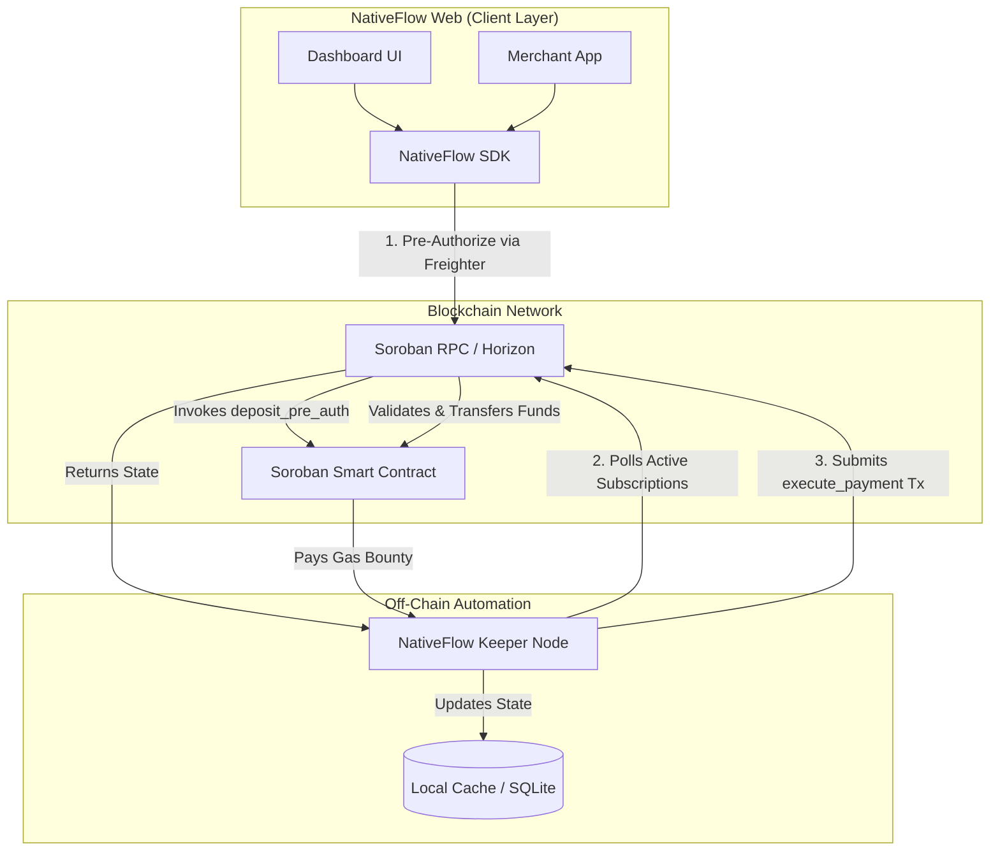

# NativeFlow Architecture

## Overview
NativeFlow is a non-custodial, decentralized recurring payments and subscriptions protocol built on the Stellar network using Soroban smart contracts. It enables merchants to accept recurring payments (e.g., USDC, XLM) while users retain full custody of their funds until the exact moment of execution, leveraging Stellar's native Auth framework.

---

## Organization Structure (Multi-Repo)
To support isolated CI/CD pipelines and allow contributors to focus on their domain expertise, the NativeFlow ecosystem is distributed across three primary repositories.

### Core Repositories
1. **`nativeflow-contracts`**: The core Soroban smart contracts written in Rust.
2. **`nativeflow-keeper`**: The off-chain Rust daemon responsible for triggering subscription payments.
3. **`nativeflow-web`**: A monorepo containing both the TypeScript client SDK and the Next.js reference dashboard.

---

## High-Level System Architecture

---

## Component Deep Dive

### 1. `nativeflow-contracts` (On-Chain Logic)

The source of truth for the protocol. It handles user permissions, subscription terms, and token transfers.

* **Language**: Rust
* **Framework**: `soroban-sdk`
* **Key Mechanisms**:
* **State Management**: Uses `Persistent` storage to map `(Subscriber, Merchant)` to a `SubscriptionConfig` struct containing the token, amount, interval, and last charge timestamp.
* **Native Authentication**: Implements `Address::require_auth()` to ensure only the user can authorize a subscription creation or cancellation.
* **Execution Logic**: The `execute_payment` function can be called by anyone. It verifies the interval constraint, performs the token transfer via the token contract, and updates the timestamp.

### 2. `nativeflow-keeper` (Automation Daemon)

Smart contracts cannot execute on a timer. The Keeper is an off-chain infrastructure component that monitors the blockchain and triggers payments when they are due.

* **Language**: Rust
* **Core Crates**: `tokio` (async runtime), `stellar-rpc-client`, `stellar-xdr`, `sqlx` (for SQLite cache).
* **Key Mechanisms**:
* **State Indexer**: Periodically polls Soroban RPC for events emitted by the `nativeflow-contracts` to maintain an updated local database of active subscriptions.
* **Time-Wheel Execution**: Continuously checks the local database for subscriptions passing their next due date.
* **Transaction Submitter**: Constructs the `execute_payment` XDR, signs it, and submits it to the network.
* **Incentive Model**: Pockets the protocol bounty programmed into the smart contract to offset gas fees.

### 3. `nativeflow-web` (SDK & UI Monorepo)

Consolidates the developer tooling and the consumer-facing interface into a single repository for seamless end-to-end testing and integration.

* **SDK (`/sdk`)**:
* **Language**: TypeScript
* **Purpose**: A lightweight wrapper around Stellar's Horizon and Soroban RPC clients.
* **Key Modules**: `SubscriptionClient` for user actions (subscribe, unsubscribe) and `MerchantClient` for merchant actions (generate links, verify payments). Abstracts away raw XDR building.

* **Dashboard (`/dashboard`)**:
* **Stack**: Next.js (React), Tailwind CSS, TypeScript.
* **Subscriber Portal**: Interface to connect a wallet, view active recurring out-flows, and one-click cancel subscriptions.
* **Merchant Portal**: Interface to generate embeddable subscription links, view total active subscribers, and monitor monthly recurring revenue (MRR).

---

## Core Workflows

### A. Subscription Creation (User Flow)

1. User clicks "Subscribe" on a merchant's website.
2. The Merchant app uses the NativeFlow SDK to request a connection to the user's wallet.
3. The SDK builds an invocation for `deposit_pre_auth(merchant_id, token, amount, interval)`.
4. The user signs the transaction.
5. The Soroban contract records the subscription in persistent state and emits a `SubscriptionCreated` event.

### B. Payment Execution (Keeper Flow)

1. The Keeper daemon indexes the `SubscriptionCreated` event and caches it locally.
2. The Keeper evaluates the `next_charge_date` against the current UTC time.
3. Once the interval passes, the Keeper builds an `execute_payment(subscriber, merchant)` transaction.
4. The Keeper signs and submits the transaction.
5. The contract verifies the time constraint, transfers tokens, and emits a `PaymentExecuted` event.
6. The Keeper indexes the event and resets the `next_charge_date`.
